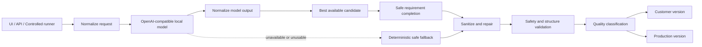

# OpenAI-compatible 本地模型 PPT 脚本生成器

一个本地优先、结果优先的 PPT 脚本生成器。它把业务表单、客户材料和可选的本地模型规划转成可编辑的客户版脚本、制作版脚本和质量状态。

> Release candidate: `v2.3.15-rc4`。本项目承诺的是：对主题和基本用途可识别的正常请求，尽可能返回可编辑结果；不承诺任意本地模型都达到相同质量，也不代替人工审核。

## 项目简介

项目支持用户自行配置兼容 OpenAI Chat Completions 的本地模型服务，同时在模型不可用或输出不可安全采用时，返回明确标记的确定性安全兜底脚本。它输出的是 PPT 制作脚本和生产指导，而不是最终 `.pptx` 文件。

## 功能截图

发布仓库仅接受脱敏演示截图或 GIF。请将不含客户资料、密钥、请求证据或本机路径的图片放入 [`docs/assets`](docs/assets/README.md)，然后在此处链接：

```text
docs/assets/demo-result.png 或 docs/assets/demo-flow.gif（待维护者提供公开演示素材）
```

## 核心能力

- 支持 OpenAI Chat Completions 兼容的本地服务，包括 OpenWebUI、Ollama、LM Studio、MLX server、llama.cpp server 和 vLLM。
- Qwen 只是已测试模型示例，不是产品边界，也不是业务分支条件。
- 简易模式快速生成页级脚本；专业模式包含追问、需求摘要和完整脚本。
- 模型成功时使用经标准化、补齐和安全清洁的最佳候选结果。
- 模型不可用、超时、空响应或输出无法安全使用时，返回独立的确定性安全兜底版。
- 事实安全、禁止内容、结构完整性和公开 API 脱敏依然受程序保护。

## Result-First 流程



正式 UI、`POST /api/outline` 和 controlled runner 共用同一条 pipeline。普通质量问题只会影响结果等级和复核提示，不会隐藏已经安全且可展示的脚本。

## 下载方式

可以选择任一方式：

1. 在 GitHub Releases 中下载指定版本压缩包。
2. 在 GitHub 仓库页面选择 **Code → Download ZIP**。
3. 使用 Git 获取源码：

```bash
git clone https://github.com/t64c6d7mc5-debug/ppt-outline-generator.git
cd ppt-outline-generator
```

压缩包下载后请先解压，再在项目根目录执行后续命令。

## 环境要求

- Node.js 22 或更高版本。
- npm。
- 可选：一个 OpenAI Chat Completions 兼容的本地模型服务。没有可用模型时，应用仍可返回明确标记的安全兜底版。

## 快速启动

```bash
npm install
./scripts/check-environment.sh
./scripts/start.sh
```

没有 `.env` 也可以启动：脚本会明确进入确定性 fallback 模式。需要保存端口或后续启用模型时再复制模板：`cp .env.example .env`。macOS 也可以双击 `scripts/start-macos.command`。脚本从自身位置定位项目根目录，不会使用个人桌面路径、下载模型或改写第三方服务。示例 `.env` 使用 `3100`；以终端实际输出为准。更完整的中英文说明、provider 示例和排障步骤见 [docs/QUICK_START.md](docs/QUICK_START.md)。

## 通用本地模型配置

`.env.example` 是安全模板，默认 `LOCAL_MODEL_ENABLED=false`。这使未配置模型的新用户也能启动，并获得明确标记的确定性 fallback。不要提交 `.env`。

| 变量 | 含义 |
| --- | --- |
| `PORT` | 应用监听端口。 |
| `LOCAL_MODEL_ENABLED` | 是否尝试调用本地模型。 |
| `LOCAL_MODEL_PROVIDER` | Provider 标识，通用值为 `openai-compatible`。 |
| `LOCAL_MODEL_BASE_URL` | OpenAI-compatible API 基础地址，通常以 `/v1` 或运行时的 API 前缀结尾。 |
| `LOCAL_MODEL_API_KEY` | 可选的本地访问凭据；无需鉴权时留空。 |
| `LOCAL_MODEL_ID` | 本地服务暴露的实际模型 ID。 |
| `LOCAL_MODEL_TIMEOUT_MS` | 单次请求超时上限，毫秒。 |
| `LOCAL_MODEL_SUPPORTS_JSON_SCHEMA` | 仅在运行时确实支持 JSON Schema 时设为 `true`。 |
| `LOCAL_MODEL_MAX_REPAIR_ATTEMPTS` | 输出结构修复次数，只允许 `0` 或 `1`。 |

基础模板：

```env
LOCAL_MODEL_ENABLED=false
LOCAL_MODEL_PROVIDER=openai-compatible
LOCAL_MODEL_BASE_URL=http://127.0.0.1:8080/api
LOCAL_MODEL_API_KEY=
LOCAL_MODEL_ID=
LOCAL_MODEL_TIMEOUT_MS=120000
LOCAL_MODEL_SUPPORTS_JSON_SCHEMA=true
LOCAL_MODEL_MAX_REPAIR_ATTEMPTS=1
```

示例地址是 OpenWebUI 常见本地地址，不是产品默认绑定。只有在已填写实际 endpoint、模型 ID 和必要凭据后，才将 `LOCAL_MODEL_ENABLED=true`；如运行时不支持 JSON Schema，请把 `LOCAL_MODEL_SUPPORTS_JSON_SCHEMA` 改为 `false`。本地模型不是强制依赖；启用后可获得更丰富、更贴合需求的生成内容。

## 常见 provider 示例

| 运行时 | `LOCAL_MODEL_BASE_URL` 示例 | 说明 |
| --- | --- | --- |
| OpenWebUI | `http://127.0.0.1:8080/api` | 示例为 OpenWebUI 常见本地地址；可使用模型别名。 |
| Ollama | `http://127.0.0.1:11434/v1` | 需启用其 OpenAI-compatible endpoint。 |
| LM Studio | `http://127.0.0.1:1234/v1` | 先在 LM Studio 中启动 Local Server。 |
| MLX server | `http://127.0.0.1:8000/v1` | 端口以实际启动参数为准。 |
| llama.cpp server | `http://127.0.0.1:8080/v1` | 请避免与其他本地服务占用同一端口。 |
| vLLM | `http://127.0.0.1:8000/v1` | 模型 ID 与 vLLM 对外暴露名称保持一致。 |

上述全部是示例，不是写死的产品地址。旧版 `OPENWEBUI_BASE_URL` / `OPENWEBUI_API_KEY` 仅作兼容别名；新配置优先使用 `LOCAL_MODEL_*`。

## 生成模式

| 模式 | 流程 | 适合场景 |
| --- | --- | --- |
| 简易模式 | `lightweight_outline` | 快速形成可编辑页级脚本。 |
| 专业模式 | `clarifying_questions` → `requirements_summary` → `full_quality_outline` | 复杂材料、正式提案和需要追问的任务。 |

追问或需求摘要的模型调用失败时，系统会使用安全的通用追问或确定性摘要，并如实标记来源。

## 结果状态

| 状态 | HTTP | 展示行为 |
| --- | --- | --- |
| `production_ready` | 200 | 安全、结构完整，默认分数不低于 95，且没有需要人工复核的质量警告。展示两种完整版本。 |
| `review_required` | 200 | 脚本安全且可展示，但分数未达到生产标准，或存在覆盖、措辞、标题、相关性或模型内容保留率问题。展示两种完整版本和脱敏复核提示。 |
| `fallback` | 200 | 模型不可用或候选内容无法安全采用，已根据用户表单生成确定性安全兜底版。它不是模型生成结果，但仍可编辑、复制和继续制作。 |
| `blocked` | 422 | 仅在请求无法识别，或模型候选与安全兜底都无法形成无泄漏、无禁止内容、非空且结构完整的脚本时返回。 |

`score` 只用于质量分级和提示，不会单独导致 `blocked`。`model_content_retained=false`、planner 被拒绝、关键词被改写或普通语义覆盖不足也不会单独隐藏结果。

## 公开 API 结果摘要

HTTP 200 响应包含：

- `quality_status`、`score`、`production_threshold`和脱敏 `review_warnings`；
- `source_summary`，区分模型尝试、实际采用、确定性补齐和 fallback；
- 非空 `customer_version` 和 `production_version`；
- 可编辑 `outline` 与脱敏 `quality_report`。

公开响应不应包含 API Key、Token、内部 Prompt、本机绝对路径、binding ID、hash、lineage 内部对象、allocation 内部数据或客户材料原文。

## 常见问题

- **缺少 `.env`**：从 `.env.example` 复制，不要将真实凭据提交到仓库。
- **本地服务不可达**：确认模型服务已启动，并核对 `LOCAL_MODEL_BASE_URL`。
- **模型未找到**：将 `LOCAL_MODEL_ID` 设为服务 `/models` 或管理界面实际显示的 ID。
- **401 / 403**：需要鉴权时填写 `LOCAL_MODEL_API_KEY`；无需鉴权时留空。
- **返回 fallback**：这是可用的安全结果，不是模型成功。查看 `source_summary` 区分调用与内容来源。
- **返回 `review_required`**：脚本已可展示；先复核 `review_warnings`、待确认事实和页级完整度。
- **端口占用**：修改 `.env` 中的 `PORT`，或停止占用同一端口的旧应用进程。

## 隐私与质量声明

项目默认面向本地处理，但你仍需自行确认模型服务、日志、浏览器扩展和操作系统账户的实际数据边界。不同模型的指令遵循、JSON 稳定性和内容水平会有差异。所有状态的结果都建议人工复核，特别是待确认事实、数字、商业关系和行动承诺。

详细限制见 [KNOWN_LIMITATIONS.md](KNOWN_LIMITATIONS.md)，安全报告见 [SECURITY.md](SECURITY.md)，架构见 [docs/ARCHITECTURE.md](docs/ARCHITECTURE.md)。

## 项目目录

```text
.
├── lib/                 # 服务端 pipeline、模型适配、清洁与渲染
├── js/                  # 浏览器 UI 和请求构建
├── docs/                # 公开架构、安装和状态说明
├── examples/             # 脱敏输入与双版本输出示例
├── scripts/             # 通用启动、环境检查、发布审计和 manifest 工具
├── test/                # 脱敏的自动化测试
├── .env.example         # 可复制的通用配置模板
└── server.js            # HTTP 入口
```

`.env`、模型权重、真实回归、验收证据、客户材料、数据库、日志、缓存和个人启动器均不属于公开候选树。

## 开发、测试与贡献

开发前请复制 `.env.example` 为本机 `.env`；不要提交真实配置或客户材料。提交修改前运行：

```bash
npm test
npm run check
bash scripts/prepublish-check.sh
```

贡献流程、测试边界和 PR 说明见 [CONTRIBUTING.md](CONTRIBUTING.md)。项目不会初始化或替你推送 GitHub；请先完成人工审查，再自行创建仓库、commit 和发布。

## License

MIT，见 [LICENSE](LICENSE)。

---

## English

This is an OpenAI-compatible local-model PPT script generator with a result-first delivery policy. See [README_EN.md](README_EN.md) for the complete English download, setup, provider, status, privacy, and troubleshooting guide.
