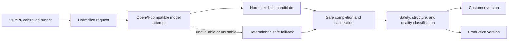

# OpenAI-Compatible Local-Model PPT Script Generator

A local-first, result-first application that turns business forms, source material, and optional local-model planning into an editable customer script, a production script, and a transparent quality status.

> Release candidate: `v2.3.15-rc2`. The product goal is to return an editable result for a normal request with a recognizable topic and purpose. It does not promise equal quality from every model, and it does not replace human review.

## Screenshot placeholder

Only sanitized demo screenshots belong in [`docs/assets`](docs/assets/README.md). Do not publish customer material, credentials, request evidence, internal diagnostics, or local paths.

```text
docs/assets/demo-result.png (to be supplied by the maintainer)
```

## What it supports

- Any local service that exposes an OpenAI-compatible Chat Completions endpoint, including OpenWebUI, Ollama, LM Studio, MLX server, llama.cpp server, and vLLM.
- Qwen as a tested model example, not a required model and not a product-specific branch.
- Simple mode for a fast slide-by-slide script.
- Professional mode for clarifying questions, a requirements summary, and the full script.
- Model-output normalization, safe deterministic requirement completion, content sanitization, and source transparency.
- A deterministic safe fallback when a model is unavailable, times out, returns empty content, or cannot provide a usable candidate.

The application generates PPT scripts and production guidance. It does not render a final `.pptx` file.

## Download

After the public repository is available, choose one method:

1. Download a versioned archive from GitHub Releases.
2. Use **Code → Download ZIP** on the repository page.
3. Clone the source:

```bash
git clone <repository-url>
cd local-llm-ppt-script-generator
```

If you downloaded an archive, extract it and run the following commands from the project root.

## Result-First Pipeline



The browser UI, API, and controlled runner use the same pipeline. Ordinary quality issues change the status and review guidance; they do not hide a safe, displayable script.

## Requirements

- Node.js 22 or newer.
- npm.
- Optional: a running OpenAI-compatible local model service. If no usable model is available, the app can still return a clearly labeled deterministic fallback.

## Install and start

```bash
cp .env.example .env
# Edit .env with your own local endpoint and model ID.
npm install
./scripts/check-environment.sh
./scripts/start.sh
```

On macOS, `scripts/start-macos.command` is a generic double-click launcher. It resolves the repository root from its own location and never uses a personal Desktop path. The template uses port `3100`; trust the address printed by the server.

## Generic local-model configuration

Use the `LOCAL_MODEL_*` variables in `.env`:

```env
LOCAL_MODEL_ENABLED=true
LOCAL_MODEL_PROVIDER=openai-compatible
LOCAL_MODEL_BASE_URL=http://127.0.0.1:8080/api
LOCAL_MODEL_API_KEY=
LOCAL_MODEL_ID=
LOCAL_MODEL_TIMEOUT_MS=120000
LOCAL_MODEL_SUPPORTS_JSON_SCHEMA=true
LOCAL_MODEL_MAX_REPAIR_ATTEMPTS=1
```

The address above is a common OpenWebUI example, not a product binding. Use the URL and model ID shown by your own runtime. Set JSON Schema support to `false` when the runtime rejects it.

| Variable | Purpose |
| --- | --- |
| `LOCAL_MODEL_ENABLED` | Enables a local-model attempt. |
| `LOCAL_MODEL_PROVIDER` | Provider label; use `openai-compatible` for the generic adapter. |
| `LOCAL_MODEL_BASE_URL` | Base URL for the compatible API, commonly ending in `/v1` or the runtime's API prefix. |
| `LOCAL_MODEL_API_KEY` | Optional local credential. Leave it empty when the server does not require authentication. |
| `LOCAL_MODEL_ID` | The exact model ID exposed by the local server. |
| `LOCAL_MODEL_TIMEOUT_MS` | Per-request timeout in milliseconds. |
| `LOCAL_MODEL_SUPPORTS_JSON_SCHEMA` | Set to `true` only when the runtime supports JSON Schema responses. |
| `LOCAL_MODEL_MAX_REPAIR_ATTEMPTS` | Structured-output repair limit. Only `0` or `1` is supported. |

Legacy `OPENWEBUI_BASE_URL` and `OPENWEBUI_API_KEY` aliases remain available for migration. New installations should use `LOCAL_MODEL_*`.

## Provider examples

| Runtime | Example `LOCAL_MODEL_BASE_URL` | Notes |
| --- | --- | --- |
| OpenWebUI | `http://127.0.0.1:8080/api` | A common local example; aliases may be used as model IDs. |
| Ollama | `http://127.0.0.1:11434/v1` | Use its OpenAI-compatible endpoint. |
| LM Studio | `http://127.0.0.1:1234/v1` | Start Local Server first. |
| MLX server | `http://127.0.0.1:8000/v1` | Use the address selected when starting the server. |
| llama.cpp server | `http://127.0.0.1:8080/v1` | Avoid port conflicts with other local services. |
| vLLM | `http://127.0.0.1:8000/v1` | Match `LOCAL_MODEL_ID` to the served model name. |

These are provider examples only. No host, port, model ID, or model family is hard-coded as the product default.

## Generation modes

- Simple mode uses `lightweight_outline` and returns an editable slide script quickly.
- Professional mode uses `clarifying_questions`, `requirements_summary`, then `full_quality_outline`.

If model-backed questions or summaries fail, the server returns safe generic questions or a deterministic summary and reports the source honestly.

## Result-First status policy

- `production_ready`: HTTP 200. The result is safe and complete, normally scores at least 95, and has no quality warning that requires review. Both full versions are visible.
- `review_required`: HTTP 200. The result is safe and displayable, but its score is below the production threshold or wording, coverage, title, relevance, or model-retention warnings need review. Both full versions remain visible.
- `fallback`: HTTP 200. The local model was unavailable or its candidate was unusable, so the app built a deterministic safe script from the user's request. This is not model-generated content. Both full versions remain editable and copyable.
- `blocked`: HTTP 422. Used only when the request cannot be recovered, or neither the model candidate nor the deterministic fallback can produce non-empty, structurally valid output without unresolved safety, forbidden-content, serialization, or privacy risks.

`score` is a ranking and review signal; it does not independently cause `blocked`. A rejected planner, missing provenance, `model_content_retained=false`, renamed sections, or a normal semantic-coverage miss does not independently hide a safe result.

## Public response

A successful HTTP 200 response includes:

- `quality_status`, `score`, `production_threshold`, and redacted `review_warnings`;
- `source_summary`, which distinguishes model attempt, model use, retained model content, deterministic completion, and fallback;
- non-empty `customer_version` and `production_version` strings;
- an editable `outline` and a redacted `quality_report`.

Public responses must not expose API keys, tokens, prompts, local absolute paths, binding IDs, request hashes, internal lineage/allocation objects, or raw private customer material.

## Troubleshooting

- **Missing `.env`**: copy `.env.example` and keep the real file out of source control.
- **Connection refused**: start the local runtime and verify `LOCAL_MODEL_BASE_URL`.
- **Model not found**: use the exact ID shown by the runtime's model list or management UI.
- **401 / 403**: set `LOCAL_MODEL_API_KEY` only when authentication is required.
- **Unexpected fallback**: the script is usable but is not a successful model result. Inspect `source_summary` for the attempted and selected sources.
- **`review_required`**: review the warnings, pending facts, numbers, claims, and page coverage before production.
- **Port already in use**: change `PORT` in `.env` or stop the old app process that owns the port.

See [docs/QUICK_START.md](docs/QUICK_START.md) for a bilingual step-by-step guide and [docs/ARCHITECTURE.md](docs/ARCHITECTURE.md) for the pipeline boundary.

## Privacy, quality, and limitations

Local-first does not automatically guarantee privacy. Review the storage and logging behavior of your model runtime, browser, extensions, and operating-system account. Model adherence, structured-output stability, and writing quality vary. Human review is recommended for every status, especially for pending facts, numbers, commercial relationships, and calls to action.

The application does not auto-download model weights, provide cloud hosting or accounts, or guarantee unattended final approval. See [KNOWN_LIMITATIONS.md](KNOWN_LIMITATIONS.md), [SECURITY.md](SECURITY.md), and [CONTRIBUTING.md](CONTRIBUTING.md).

## Repository layout

```text
.
├── lib/                 # Server pipeline, model adapter, sanitization, renderers
├── js/                  # Browser UI and request builders
├── docs/                # Public architecture, setup, and status documentation
├── scripts/             # Portable start, checks, audit, and manifest tools
├── test/                # Sanitized automated tests
├── .env.example         # Generic configuration template
└── server.js            # HTTP entry point
```

The public candidate excludes `.env`, model weights, customer material, real regression evidence, screenshots, databases, logs, caches, and personal launchers.

## Development, testing, and contributions

Copy `.env.example` to a local `.env` before development, but never commit the real file. Before a change is proposed, run:

```bash
npm test
npm run check
bash scripts/prepublish-check.sh
```

See [CONTRIBUTING.md](CONTRIBUTING.md) for scope, fixture, and pull-request guidance. The project does not initialize repositories, create commits, or publish on your behalf; perform a human review before creating a GitHub repository or release.

## License

MIT. See [LICENSE](LICENSE).
